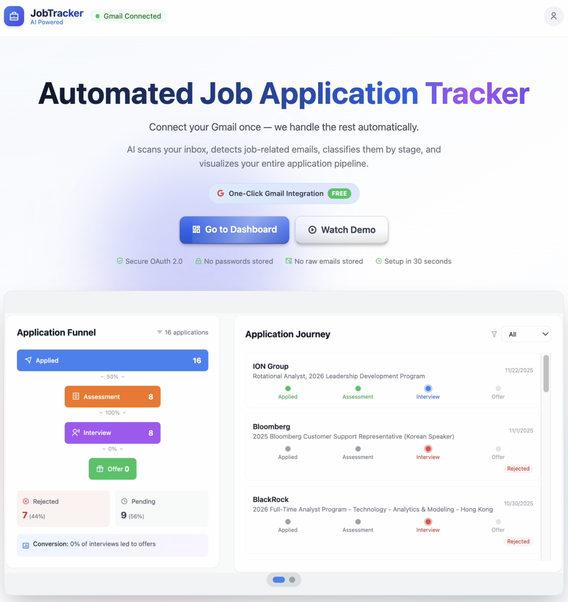

# JobTracker

AI-powered job application tracker that automatically extracts and organizes your job applications from Gmail.

## The Problem


Existing platforms like LinkedIn and Glassdoor help you discover job opportunities, but no solution automatically tracks your application progress across different companies and stages.

## Features

- **Gmail Integration** - One-click OAuth connection to scan your emails
- **AI Classification** - Automatically detects companies, positions, and application stages
- **Visual Dashboard** - Track your applications with charts and timeline views
- **Stage Tracking** - Monitor progress through aptitude tests, coding tests, interviews, and offers
- **Real-time Processing** - Live progress updates as emails are analyzed

## Tech Stack

| Component | Technology |
|-----------|------------|
| Frontend | React, Vite, Tailwind CSS |
| Backend | Python, Flask |
| AI | Azure OpenAI (GPT-4o-mini) |
| Auth | Google OAuth 2.0 |
| API | Gmail API |

## Project Structure

```
├── frontend/          # React dashboard
├── backend/           # Python email processing pipeline
├── Presentation/      # Project presentations
└── Reports/           # Project documentation
```

## Quick Start

### Frontend

```bash
cd frontend
npm install
npm run dev
```

### Backend

```bash
cd backend
pip install -r requirements.txt
python local_server.py
```

## How It Works

1. Connect your Gmail account via OAuth
2. Select a date range to scan
3. AI analyzes your emails and extracts:
   - Company names
   - Job positions
   - Application stages (applied, tests, interviews, offers/rejections)
4. View your application journey on the dashboard

## Screenshots

### Homepage



The main landing page where users can connect their Gmail account and start tracking their job applications.

### Application Funnel & Journey Timeline


Track your applications through each stage with the funnel view, and see your complete application journey with company-by-company progress tracking.

### Performance Analytics & AI Insights


Get insights into your job search performance including response rates, average response times, and AI-powered recommendations.

## License

This project is part of a Final Year Project (FYP) at HKU.
