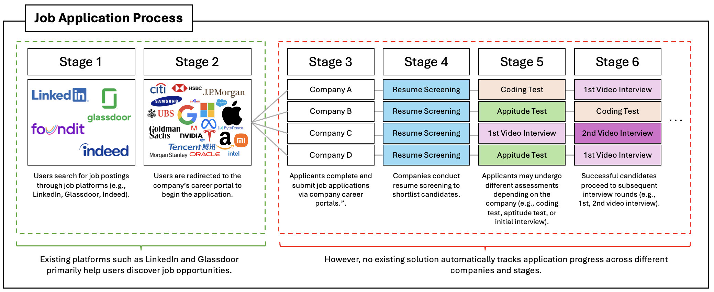
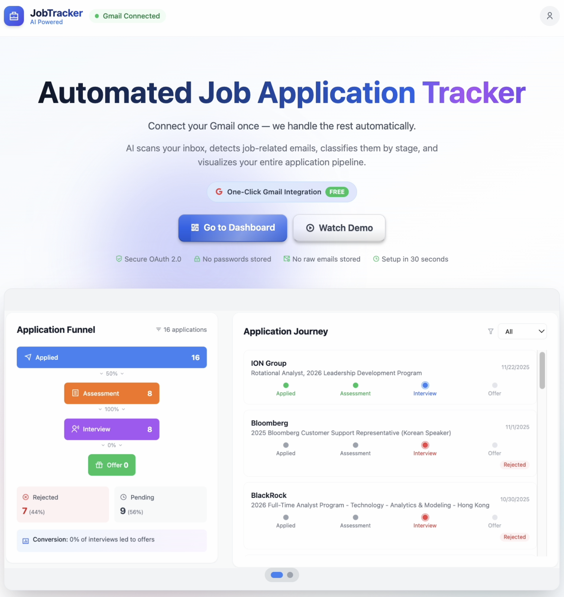
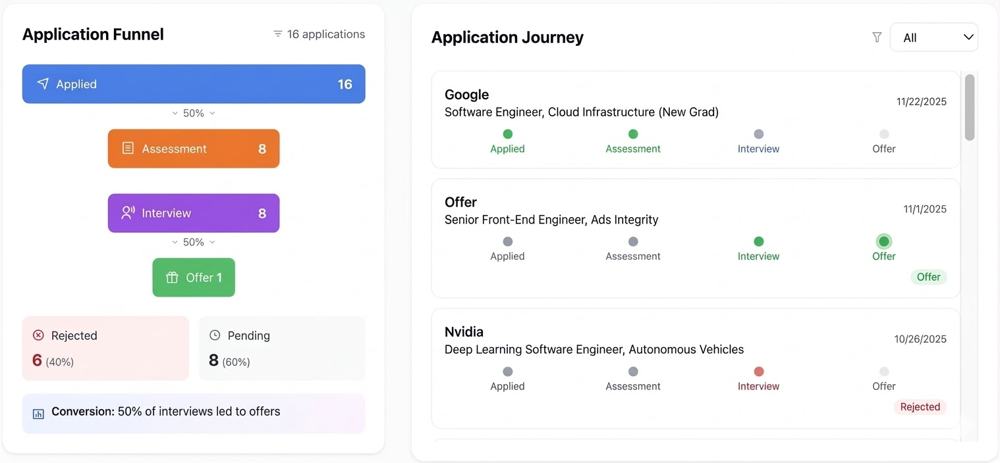
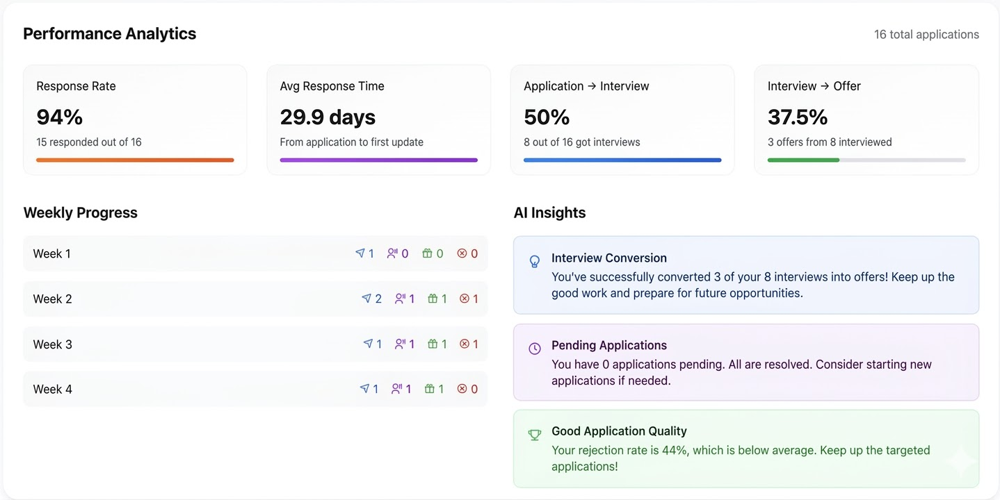

# JobTracker AI

AI-powered job application tracker that automatically extracts and organizes your job applications from Gmail.

🌐 **Live Demo:** [youraijobtracker.vercel.app](https://youraijobtracker.vercel.app)

## The Problem



Existing platforms like LinkedIn and Glassdoor help you discover job opportunities, but no solution automatically tracks your application progress across different companies and stages.

## Features

- **Gmail Integration** — One-click OAuth connection to scan your inbox
- **AI Classification** — Automatically detects companies, positions, and application stages
- **Visual Dashboard** — Track applications with funnel, Sankey diagram, and timeline views
- **Stage Tracking** — Monitor progress through aptitude tests, coding tests, video interviews, and offers
- **Real-time Processing** — Live progress updates as emails are analyzed
- **CV Analysis** — Upload your CV and get AI-powered feedback based on your application history
- **Job Recommendations** — Personalized job search powered by Adzuna API
- **Manual Entries** — Add and edit applications that weren't detected automatically
- **LinkedIn Share** — Share your job search stats directly to LinkedIn

## Tech Stack

| Component | Technology |
|-----------|------------|
| Frontend | React 19, Vite, Tailwind CSS |
| Frontend Hosting | Vercel |
| AI Processing Server | Python, Flask (AWS EC2) |
| Auth Server | Python, Flask (AWS EC2) |
| AI | OpenAI API (GPT-4o-mini) |
| Auth | Google OAuth 2.0 |
| API | Gmail API, Adzuna Jobs API |
| Reverse Proxy | nginx + Let's Encrypt SSL |

## Architecture

```
Browser (Vercel)
    ├── Gmail OAuth  →  jobtracker-auth.ddns.net  →  nginx  →  gmail_backend.py (EC2 :5678)
    └── AI Processing  →  jobtracker-api.ddns.net  →  nginx  →  local_server.py (EC2 :5001)
                                                                       └── OpenAI API (GPT-4o-mini)
```

## Project Structure

```
├── frontend/          # React dashboard (deployed on Vercel)
├── backend/           # Python email processing pipeline (deployed on AWS EC2)
└── Presentation/      # Project presentations
```

## How It Works

1. Connect your Gmail account via OAuth
2. Select a date range to scan
3. AI analyzes your emails and extracts:
   - Company names and job positions
   - Application stages (applied, assessments, interviews, offers/rejections)
4. View your complete application journey on the dashboard
5. Optionally upload your CV for AI-powered analysis and job recommendations

## Screenshots

### Homepage



### Application Funnel & Journey Timeline



Track your applications through each stage with the funnel view, and see your complete application journey with company-by-company progress tracking.

### Performance Analytics & AI Insights



Get insights into your job search performance including response rates, average response times, and AI-powered recommendations.

## License

This project is part of a Final Year Project (FYP) at HKU (COMP4801).
